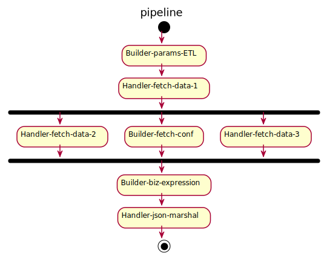

go-pipeline
------
[](https://circleci.com/Focinfi/go-pipeline)
[](https://goreportcard.com/report/github.com/Focinfi/go-pipeline)
[](https://codecov.io/gh/Focinfi/go-pipeline)

1. `Pipe`
   1. 它是一个 Handler
   1. 由配置实例化，包含一个内部处理程序
   2. 内部处理程序可以由构建器构建或由花药引用 Handler
   3. 超时运行内部处理程序

2. `Parallel`
   1. 它是一个 Handler
   2. 包含一个列表管道 Pipe
   3. 并行运行每个 Pipe.Handle
3. `Line`
   1. 它是一个 Handler
   2. 包含一个列表 Pipe
   3. 依次运行每个 Pipe.Handle
   4. 用 JSON 创建一行

//根据配置文件生成

Configurable data processing in golang. 


### Install
```bash
go get github.com/Focinfi/go-pipeline
```

### Processing Flow


1. Handler-*: References a existing Handler
2. Builder-*: Builds a Handler with config
3. Independent Handlers can process parallelly

### Handler
```go
type HandleRes struct {
	Status  HandleStatus           `json:"status"`
	Message string                 `json:"message"`
	Meta    map[string]interface{} `json:"meta"`
	Data    interface{}            `json:"data"`
}

type Handler interface {
	Handle(ctx context.Context, reqRes *HandleRes) (respRes *HandleRes, err error)
}
```

### Pipe / Parallel / Line
1. `Pipe` 
    1. It is a `Handler`
    1. Instanced by config, contains a internal handler
    2. The internal handler can be built by a builder or refrenced by anther `Handler`
    3. Run the internal hanlder with timeout

2. `Parallel`
    1. It is a `Handler`
    1. Contains a list pipes of `Pipe`
    1. Parallelly run the every `Pipe.Handle`

3. `Line`
    1. It is a `Handler`
    1. Contains a list of `Pipe`
    1. Sequently run the every `Pipe.Handle`
    1. Create a Line with JSON